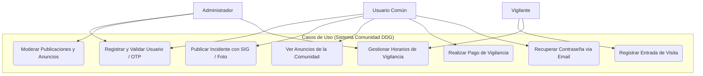

# Documentación de la API y Casos de Uso 📡

Esta sección proporciona la lista de endpoints disponibles en la API del backend, detalles de la integración con Swagger para pruebas y el diagrama de casos de uso del sistema.

---

## 📌 Acceso a Swagger UI

El backend cuenta con una documentación viva interactiva de los endpoints usando **Swagger / OpenAPI**. Puedes interactuar y probar las peticiones directamente desde el navegador:

*   **URL de Swagger**: `http://localhost:3000/api-docs` *(disponible cuando el servicio backend está activo localmente)*.
*   **Archivo de Configuración**: [`service/src/config/swagger.ts`](file:///home/gilthunder/Escritorio/Comunidad-DDG/service/src/config/swagger.ts)

---

## 📊 Diagrama de Casos de Uso

A continuación se ilustran los diferentes actores del sistema (`Administrador`, `Usuario Común` y `Vigilante`) y sus interacciones con los casos de uso:

---

## 🛣️ Resumen de Endpoints de la API

A continuación se detallan las rutas principales organizadas por módulos en el backend:

### 1. Módulo de Autenticación y Usuarios (`/api/...`)

| Método | Endpoint | Middleware | Descripción |
| :--- | :--- | :--- | :--- |
| `POST` | `/api/register` | Ninguno | Registrar un nuevo usuario (normalmente en estado inactivo). |
| `POST` | `/api/login` | Ninguno | Iniciar sesión y generar cookie con JWT. |
| `POST` | `/api/verify-otp` | Ninguno | Verificar el código OTP enviado al correo para activar cuenta. |
| `POST` | `/api/logout` | Ninguno | Limpiar cookie de sesión activa. |
| `GET` | `/api/verify` | Ninguno | Verificar la validez del token JWT actual en el frontend. |
| `GET` | `/api/profile` | `authRequired` | Obtener el perfil completo del usuario autenticado. |
| `GET` | `/api/users` | `authRequired` | Obtener todos los usuarios del sistema (solo administradores). |
| `DELETE` | `/api/users/:id` | `authRequired` | Eliminar a un usuario por ID. |
| `PUT` | `/api/profile/:id` | `authRequired` | Actualizar los datos del perfil (nombre, teléfono, edad, etc.). |
| `POST` | `/api/createUser` | `authRequired` | Crear directamente un usuario con rol específico (admin, vigilante, etc.). |
| `POST` | `/api/request-password-reset` | Ninguno | Solicitar restablecimiento de contraseña (envía OTP). |
| `POST` | `/api/confirm-password-reset` | Ninguno | Confirmar el cambio de contraseña usando el OTP recibido. |

### 2. Módulo de Tareas e Incidentes (`/api/tasks...` y `/api/taskd...`)

El sistema maneja dos tipos de publicaciones: **Tareas/Incidentes de Seguridad (Tipo 1)** y **Anuncios Especiales (Tipo 2)**.

| Método | Endpoint | Tipo | Middleware | Descripción |
| :--- | :--- | :--- | :--- | :--- |
| `GET` | `/api/tasks` | Tipo 1 | `authRequired` | Obtener todos los incidentes/publicaciones del usuario. |
| `POST` | `/api/tasks` | Tipo 1 | `authRequired` | Crear una nueva publicación (soporta ubicación SIG y estado de peligro). |
| `DELETE` | `/api/tasks/:id` | Tipo 1 | `authRequired` | Eliminar un incidente por ID. |
| `PUT` | `/api/tasks/:id` | Tipo 1 | `authRequired` | Modificar un incidente por ID. |
| `GET` | `/api/taskd` | Tipo 2 | `authRequired` | Consultar la lista de anuncios especiales de la comunidad. |
| `POST` | `/api/taskd` | Tipo 2 | `authRequired` | Publicar un anuncio especial (con o sin coordenadas). |
| `DELETE` | `/api/taskd/:id` | Tipo 2 | `authRequired` | Eliminar un anuncio especial. |
| `PUT` | `/api/taskd/:id` | Tipo 2 | `authRequired` | Modificar un anuncio especial. |

### 3. Módulo de Vigilancia y Visitas (`/api/schedules` / `/api/visit`)

| Método | Endpoint | Middleware | Descripción |
| :--- | :--- | :--- | :--- |
| `POST` | `/api/schedules` | `authRequired` | Registrar un nuevo horario de turnos semanales de vigilantes. |
| `GET` | `/api/schedules` | `authRequired` | Obtener todos los turnos y horarios asignados de vigilancia. |
| `POST` | `/api/visit` | `authRequired` | Registrar la entrada de una visita (DUI, nombre, placa, casa a visitar). |
| `GET` | `/api/visits` | `authRequired` | Consultar la bitácora completa de accesos y visitas registradas. |

### 4. Módulo de Pagos (`/api/payVigilance` / `/api/allPay`)

| Método | Endpoint | Middleware | Descripción |
| :--- | :--- | :--- | :--- |
| `POST` | `/api/payVigilance` | `authRequired` | Registrar un pago por servicio de vigilancia privada (tarjeta, CVC, monto). |
| `GET` | `/api/allPay` | `authRequired` | Obtener el historial completo de transacciones realizadas. |
