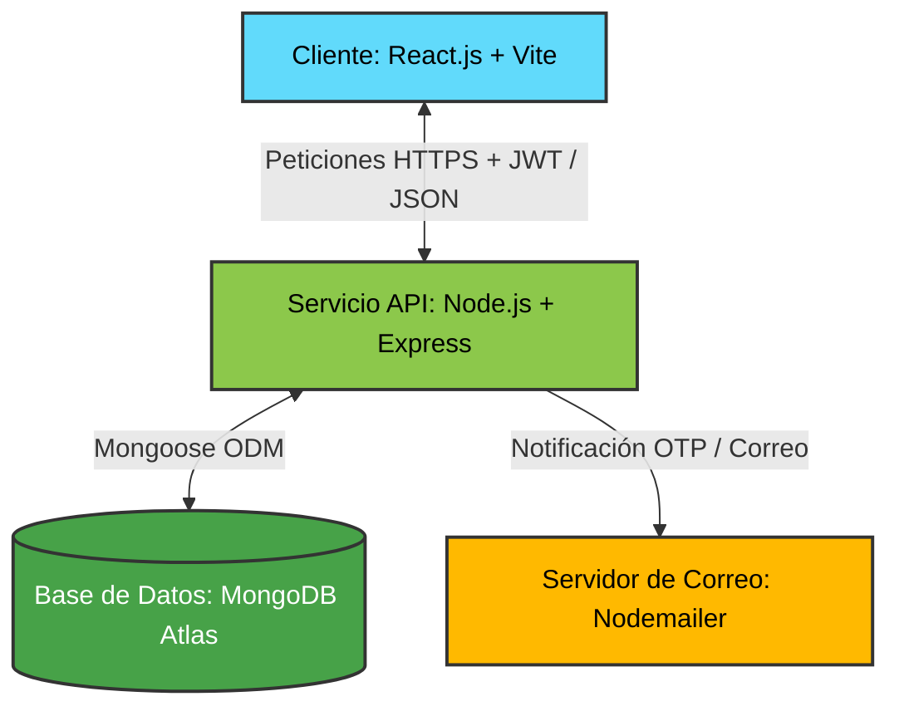
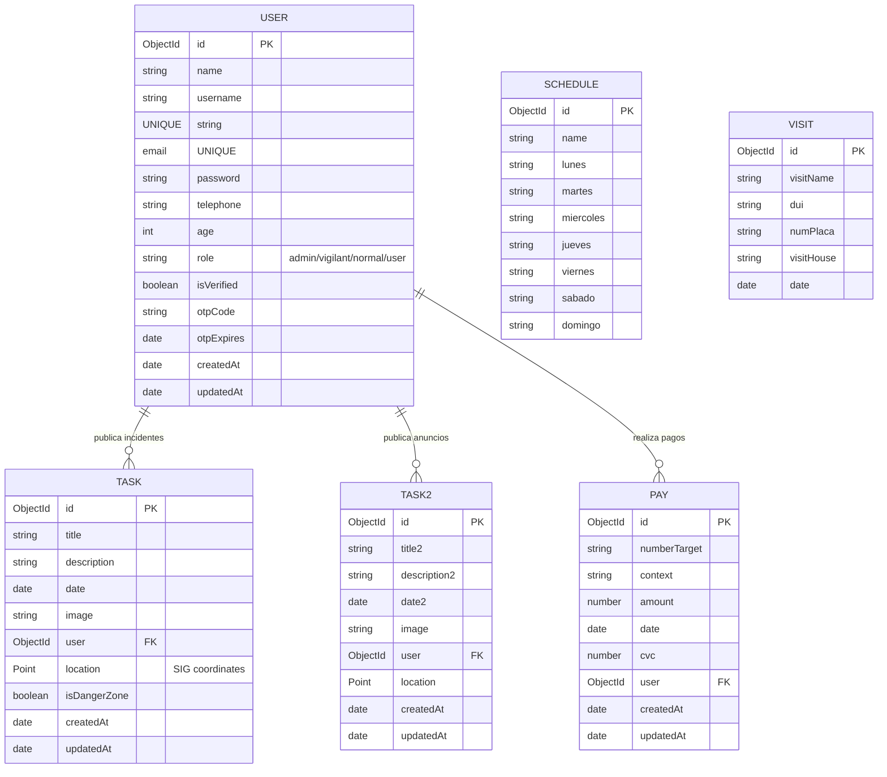

# Arquitectura y Diseño de Datos 📘

Esta sección detalla los componentes estructurales de la aplicación, las decisiones de diseño arquitectónico tomadas, la distribución de carpetas del proyecto y la estructura lógica de la base de datos.

---

## 📌 Diagrama de Arquitectura del Sistema

A continuación se muestra el flujo de comunicación y la distribución de responsabilidades entre el frontend, la API del backend, el almacenamiento y los servicios externos de mensajería:



---

## 🏗️ Decisiones Arquitectónicas

*   **React.js (Frontend)**: Permite crear una interfaz de usuario interactiva y modular a través de componentes reutilizables, agilizando el renderizado en el navegador.
*   **Node.js + Express (Backend)**: Facilita el desarrollo de un backend ligero y escalable en JavaScript, ofreciendo un gran rendimiento de E/S no bloqueante para gestionar múltiples peticiones simultáneas.
*   **MongoDB Atlas (Base de Datos)**: Base de datos NoSQL ideal para almacenar información dinámica y no estructurada como publicaciones, anuncios y bitácoras de visitas, sin las restricciones de un esquema tabular rígido.
*   **JSON Web Tokens (JWT)**: Garantiza la autenticación segura sin estado. Almacena la identidad y rol del usuario (`admin`, `vigilant`, `user`), permitiendo que el backend proteja los endpoints según los permisos del solicitante.
*   **Arquitectura Cliente-Servidor Desacoplada**: Separa completamente las responsabilidades visuales (React) de las operaciones lógicas y persistencia (Node.js/Express), facilitando la escalabilidad y el despliegue independiente.

---

## 📁 Estructura de Carpetas del Proyecto

El código fuente del proyecto se organiza bajo las siguientes estructuras lógicas para el cliente y el servidor:

### 1. Estructura del Cliente (`client/`)

```text
client/
├── public/                 # Archivos públicos de la aplicación
└── src/
    ├── api/                # Rutas y configuración de Axios para las llamadas HTTP
    ├── assets/             # Imágenes y assets visuales compartidos
    ├── components/         # Componentes transversales reutilizables
    │   ├── forms/          # Formularios (creación, edición, pagos, etc.)
    │   ├── tables/         # Tablas para visualización de datos de la app
    │   └── ui/             # Componentes básicos de interfaz (botones, inputs, mapas)
    ├── context/            # Contextos de React (AuthContext, TaskContext) para manejo de estado
    ├── hooks/              # Custom hooks (e.g. useGeolocation para el mapa SIG)
    ├── interfaces/         # Interfaces TypeScript para contratos de datos
    ├── pages/              # Vistas principales clasificadas por roles
    │   ├── admin/          # Panel administrativo y vista SIG espacial
    │   ├── home/           # Vista inicial de la landing o muro principal
    │   ├── login-access/   # Vistas de anuncios, reportes y pagos de usuarios autenticados
    │   ├── login/          # Vistas de acceso y verificación OTP
    │   └── vigilant/       # Registro de accesos, visitas y horarios
    ├── protected/          # Enrutador protegido por roles de seguridad
    └── utils/              # Tiendas de almacenamiento local y cálculos espaciales
```

### 2. Estructura del Servicio (`service/`)

```text
service/
├── config/                 # Conexión a la base de datos MongoDB Atlas
└── src/
    ├── controllers/        # Controladores controladores de peticiones HTTP
    ├── libs/               # Utilidades globales (firma JWT, nodemailer, etc.)
    ├── middlewares/        # Validaciones de tokens JWT y middleware de errores
    ├── models/             # Modelos definidos de Mongoose (esquemas de colecciones)
    ├── repository/         # Capa intermedia de acceso y operaciones a base de datos
    ├── routes/             # Endpoints y enrutado de la API
    ├── schema/             # Esquemas de validación estructural (Zod)
    ├── services/           # Lógica del negocio y reglas de dominio
    └── swagger/            # Configuración de especificaciones OpenAPI / Swagger
```

---

## 🗄️ Diagrama de Base de Datos (Modelo Entidad-Relación)

A continuación se detalla la representación física y lógica de las colecciones de MongoDB y sus interacciones de cardinalidad:


